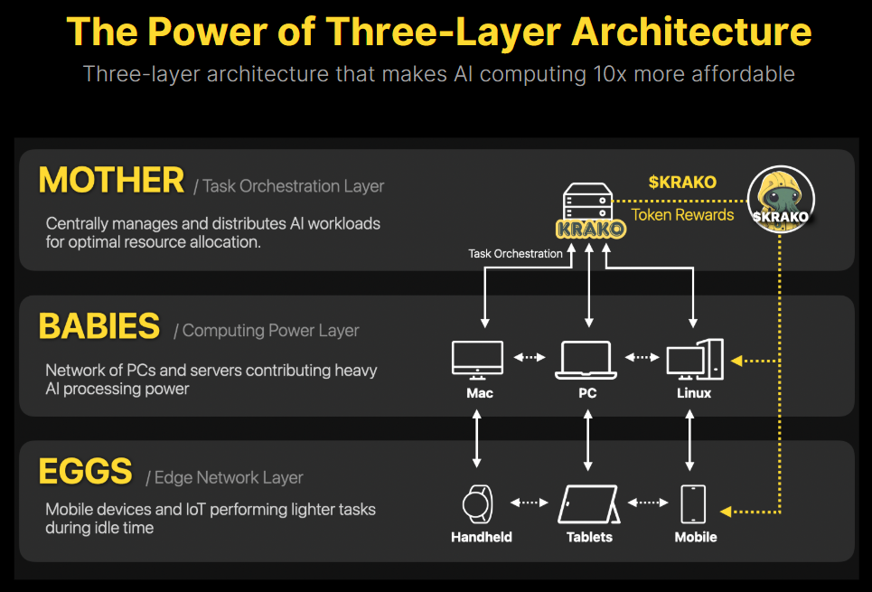
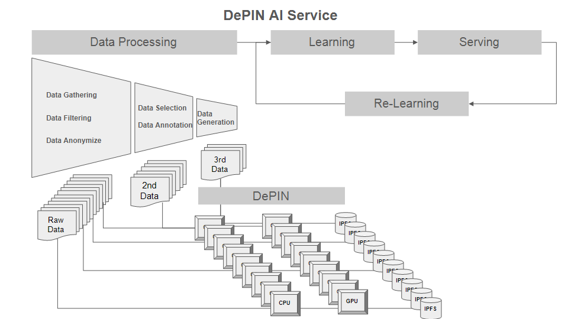
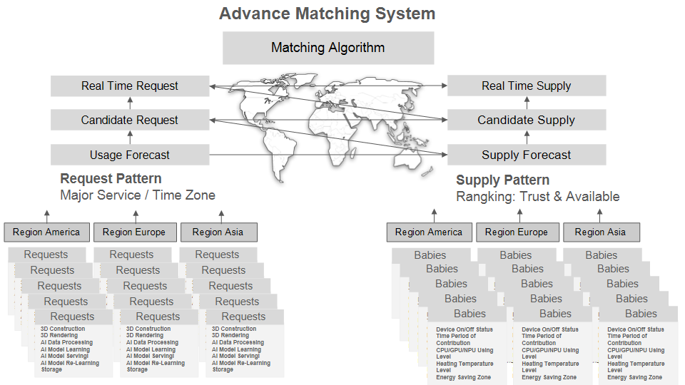
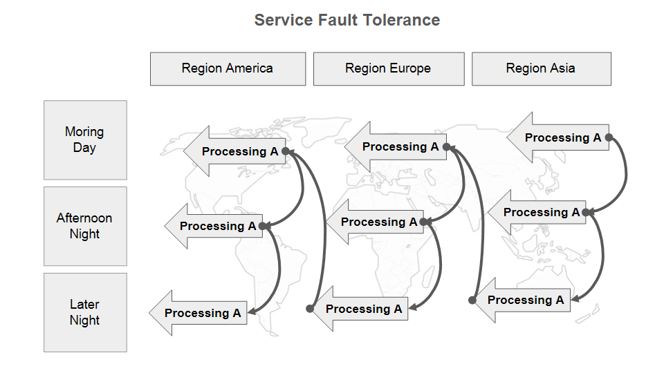
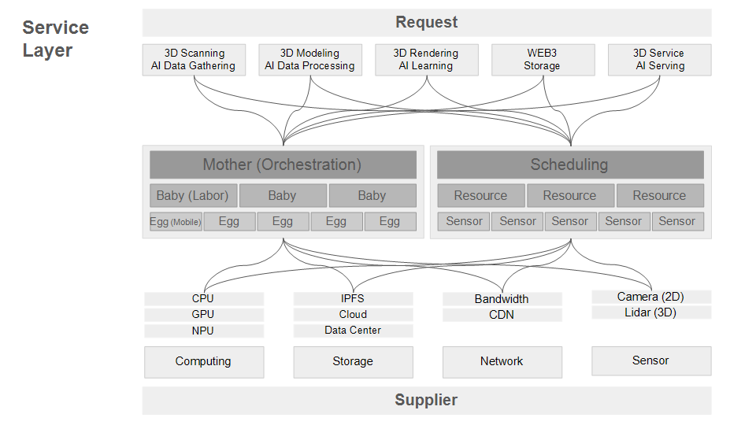

## Krako Workflow
Low Cost WEB3 Service For AI Training, Serving, Construction 3D with Decenternal Computing

### Function Structure
1. Orchestration As Mother
2. Computing Power As Babies
3. Edge Network As Eggs

### Basic Workflow
1. Krako Operation Team Set Orchestation Server

2. User(Taker) Install Krako Client on Computer or Mobile
3. Resource Provider User(Giver) set Resource Computing Power with CPU, GPU, NPU, ETC

4. Node User set request such as AI Training, Construction 3D, Capture Image/Video
5. Krako Operation Team Listup Resource Computing Power And Edge Network
6. Krako Operation Team Listup Request 
7. Kroko Matching Request and Resource with Trust Rate, Region, Service Type, ETC

8. Kroko Planning Fault tolerance with Plan B

9. Krako Load Balancing Resource with Usage Trend

11. Krako Connect Request Side and Provide Side

12. User(Taker) Review Processing Flow, Time, Security, Cost, Fault Tolerance
13. User(Taker) Uploading Data or Connect Data, Uploading Krako IPFS
