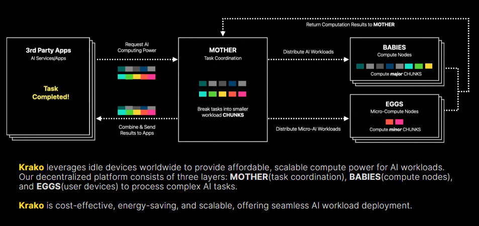
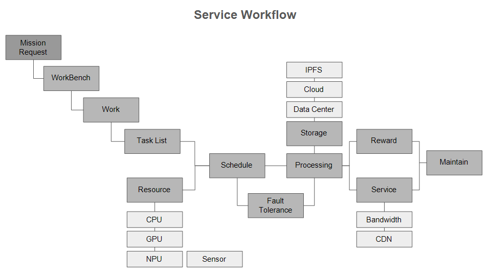
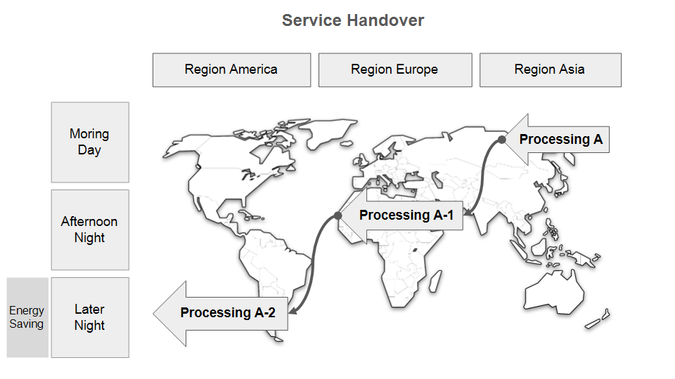
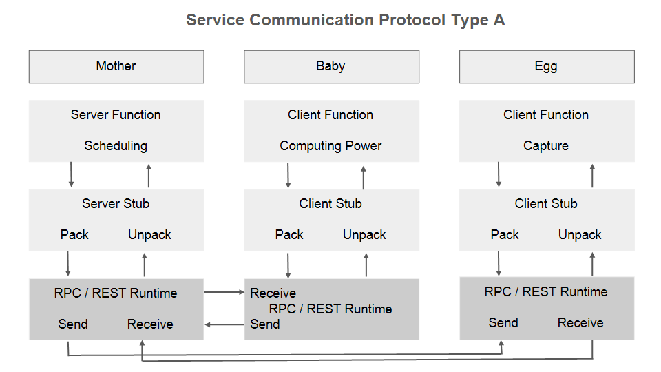
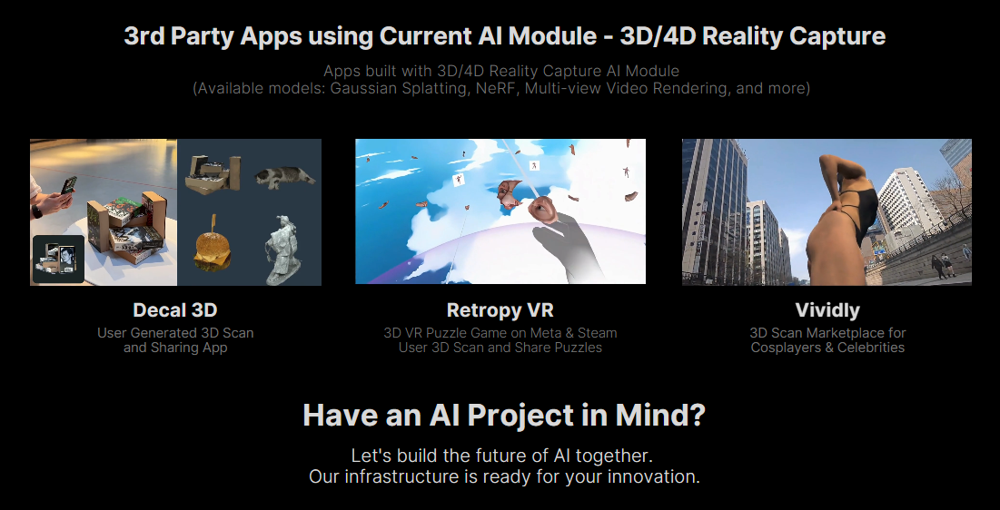
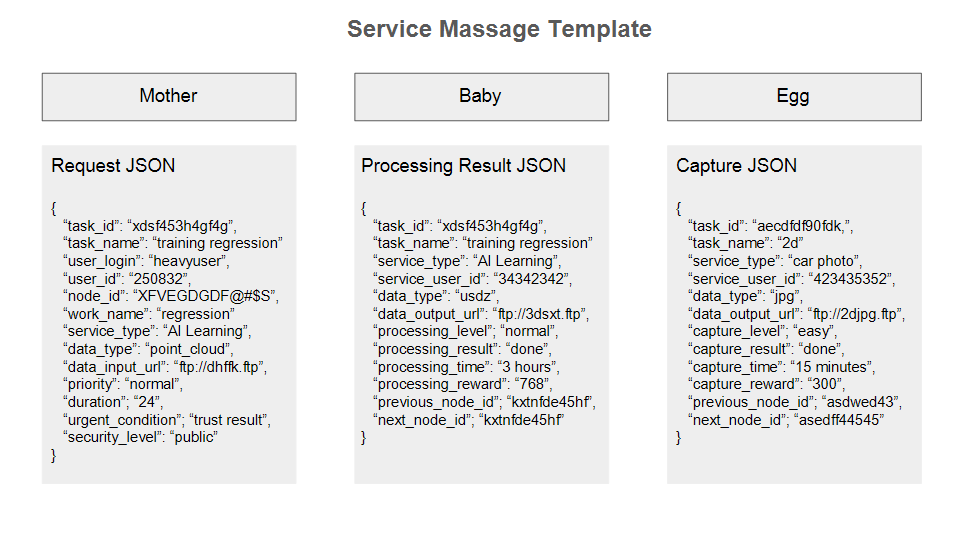
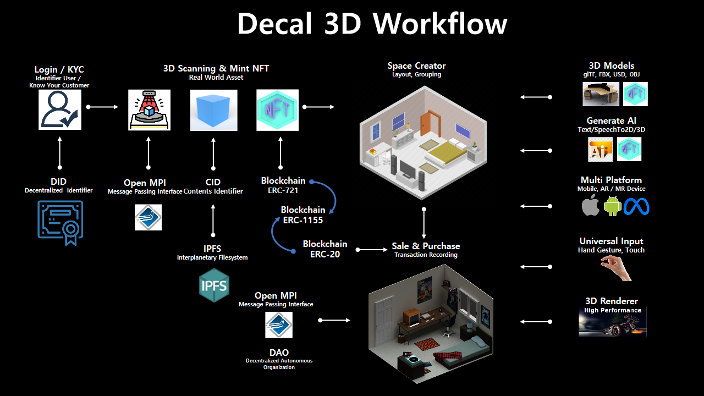
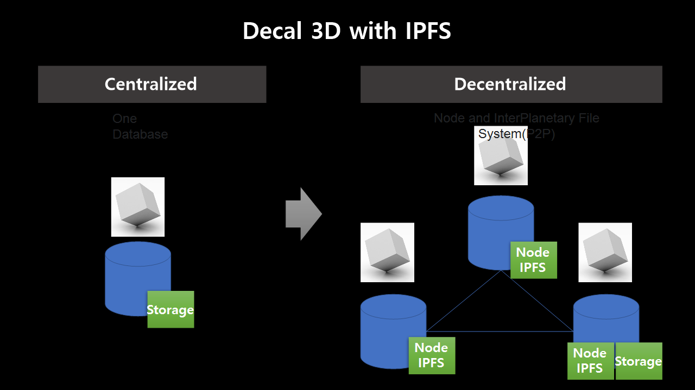
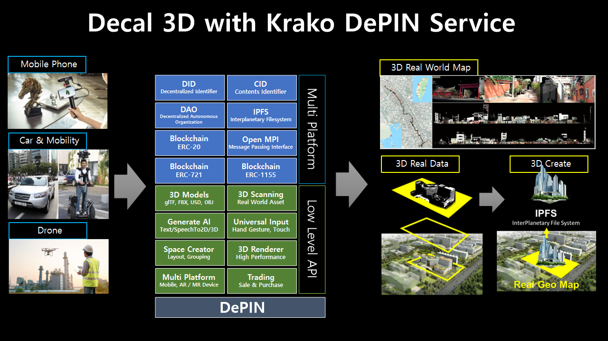
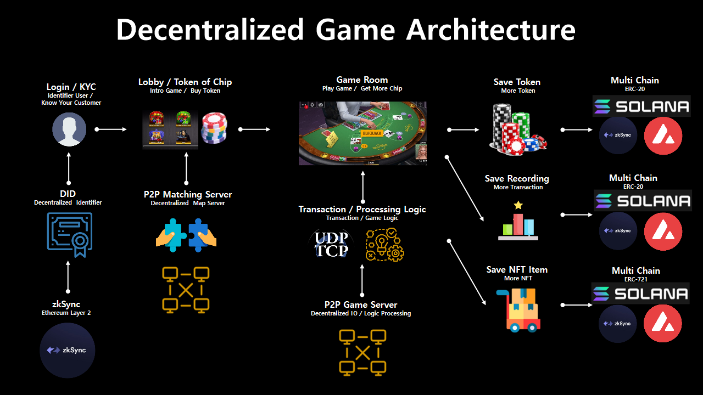

## Krako Workflow
Low Cost WEB3 Service For AI Training, Serving, Construction 3D with Decenternal Computing

### Function Structure
1. Orchestration As Mother
2. Computing Power As Babies
3. Edge Network As Eggs

### Basic Workflow
1. Krako Operation Team Set Orchestation Server

2. User(Taker) Install Krako Client on Windows/MAC/LIUNX Computer or Android/iOS Mobile
   
3. Resource Provider User(Giver) set Resource Computing Power with CPU, GPU, NPU, IPFS, ETC

4. Node User set request such as AI Training, Construction 3D, Capture Image/Video

 
5. Krako Operation Team Listup Resource Computing Power And Edge Network

 
6. Krako Operation Team Listup Request AI Traning, Serving, 3D Consturction 

 
7. Kroko Matching Request and Resource with Trust Rate, Region, Service Type, ETC

8. Kroko Planning Fault tolerance to Plan B with Region Handover 

9. Krako Load Balancing Resource with Usage Traffic Trend

10. Krako Connect Request Side and Provide Side

11. User(Taker) Review Processing Flow, Time, Security, Cost, Fault Tolerance

 
12. User(Taker) Uploading Data or Connect Data, Uploading Krako IPFS

13. Processing With 3rd Party Application

14. Return Result With JSON

15. 3rd Party Application Decal 3D Workflow

16. 3rd Party Application Decal 3D Data Save

17. 3rd Party Application Decal 3D with Krako DePIN Service

18. 3rd Party Game with Krako DePIN Service

